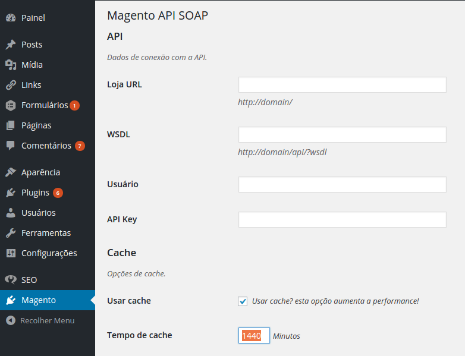

# Magento API SOAP
A Wordpress plugin to integrate with Magento.

## Settings



## How to use!

```php
<?php
	use Magento\API\SOAP\Product;
	
	//Get a single product by id.
	$product_model = new Product( 1 );
	
	$product_model = new Product();
	
	//Get 4 products with status 1 randomly.
	$products_model = $product_model->find( array( 'max' => 4, 'random' => true, 'magento_filter' => array( 'status' => 1 ) ) );
	
	//Iterate on products.
	foreach ( $products_model->list as $product_model ) :
		$name      = $product_model->name;
		$price     = $product_model->get_formated_price();
		$thumbnail = $product_model->get_thumbnail_url();
		$permalink = $product_model->get_permalink();
	endforeach;
```
