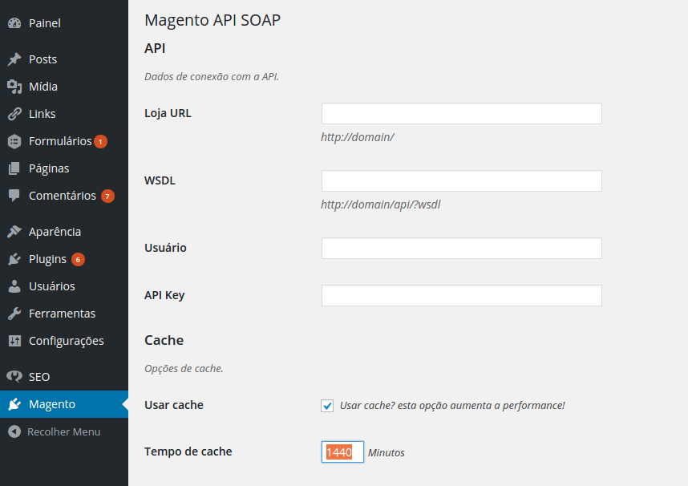

# Magento API SOAP
A Wordpress plugin to integrate with Magento.

## Settings



## How to use!

```php
use Magento\API\SOAP\Product;

//Get a single product by id.
$product_model = new Product( 1 );

$product_model = new Product();

//Get 4 products with status 1 randomly.
$products_model = $product_model->find( array( 'max' => 4, 'random' => true, 'magento_filter' => array( 'status' => 1 ) ) );

//Iterate on products.
foreach ( $products_model->list as $product_model ) :
    $name      = $product_model->name;
	$price     = $product_model->get_formated_price();
	$thumbnail = $product_model->get_thumbnail();
	$permalink = $product_model->get_permalink();
endforeach;
```

You can also extend the Product class and create your own collection of products with custom fields:

```php
class Book extends Product
{
	public $num_pages;
}
```

## Contributing
1. Fork it!
2. Create your feature branch: `git checkout -b my-new-feature`
3. Commit your changes: `git commit -m 'Add some feature'`
4. Push to the branch: `git push origin my-new-feature`
5. Submit a pull request :D

## License
[MIT License](http://opensource.org/licenses/MIT)
